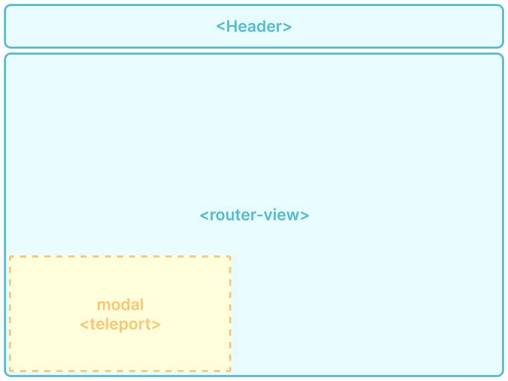
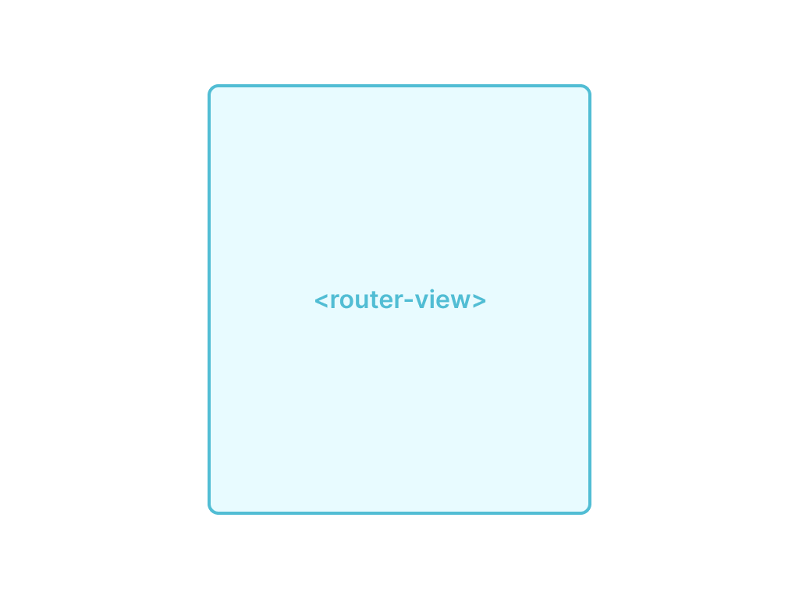

# Структура приложения
Структура приложения представляет собой праильное наследование route'ов во *VueRouter*.
Так выделяется 3 ветки наследования route'ов:
1. Страницы авторизации
2. Базовые страницы

*Структура Базовых страниц*

*Структура Страниц авторизации*

# Структура директорий
Структура директорий представляет собой правильную конфигурацию папок:

* В папке `assets` находятся папки `styles` - в которой схарятся глобальные стили проекта, `images` - статичные изображения (иконки, изображения и т.д.)

* О папке `components` будет сказано далее...

* В папке `router` будут храниться index файл роутера, а также сторонние файлы, в которых будут храниться роуты и хуки (hook.js, authRoutes.js)

* В папке `store` хранятся файлы, необходимые для vuex, конфигурация глобального хранилища.

* В папке `views` хранятся полнеценные страницы - папки. Каждая папка содержит в себе vue-файл страницы и js-файл controller.  *Папка и vue файл должны иметь одинаковые названия!*

* В папке `components` хранятся компоненты - папки. Каждая папка имеет то же название, что и vue-файл, если в ней находится один vue-файл (и/или его контроллер), либо папка имеет название, четко и коротко отображающее назначение vue-компонентов внутри.
В папке может быть несколько папок-компонентов или самих vue компонентов, но во втором случае для них должен использоваться один controller. Иначе говоря, каждый vue-файл имеет доступ к контроллеру, находящемуся в той же дирректории на том же уровне, что и компонент.

